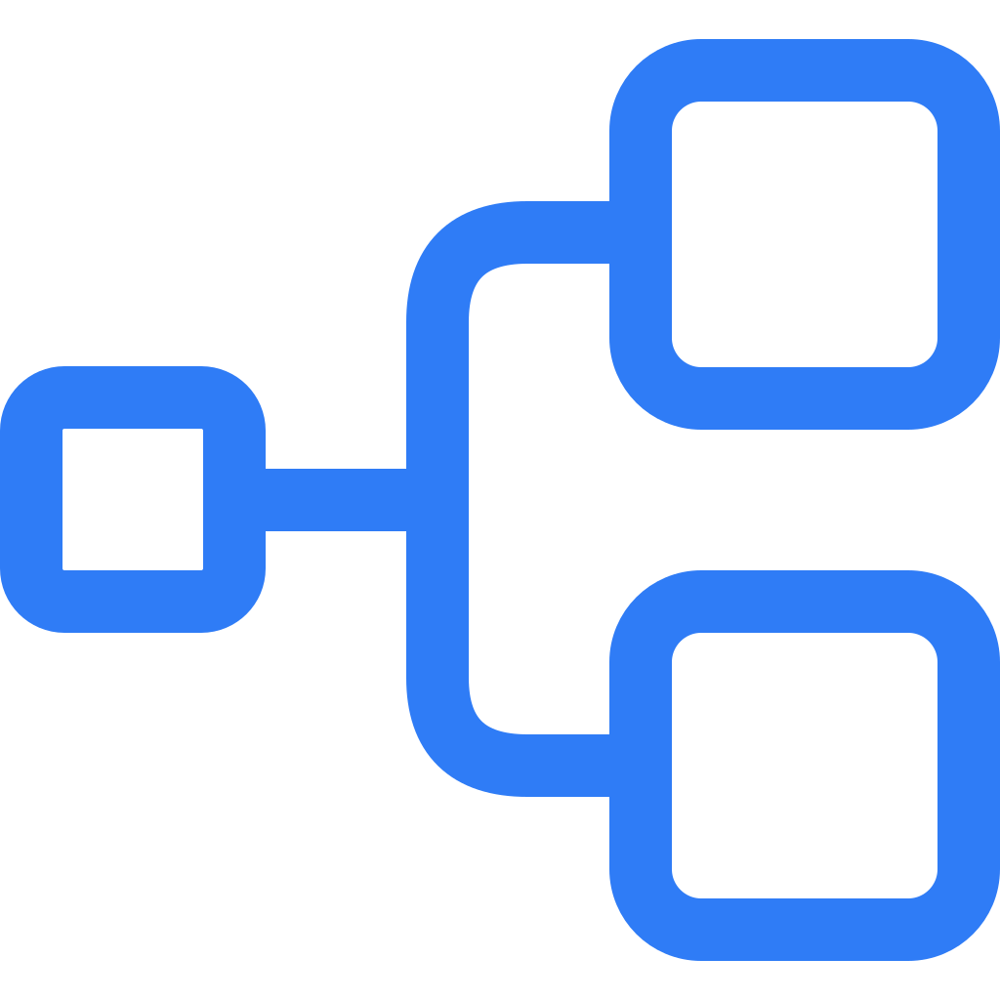

<p align="center">
  
</p>

<h1 align="center">Interloper</h1>
<h3 align="center">The ultra-portable data asset framework</h3>

<p align="center">
  <a href="https://github.com/digitl-cloud/interloper/actions/workflows/checks.yaml"></a>
  <a href="https://codecov.io/gh/digitl-cloud/interloper"></a>
  <a href="https://pypi.org/project/interloper-core/"></a>
  
  <a href="https://github.com/digitl-cloud/interloper/blob/main/LICENSE"></a>
</p>

<p align="center">
  <a href="https://docs.interloper.dev">Documentation</a> ·
  <a href="https://docs.interloper.dev/tutorial/">Tutorial</a> ·
  <a href="CHANGELOG.md">Changelog</a>
</p>

Assets are functions that produce data. Sources group them, destinations store them, a DAG runs
them. The same code runs in a notebook, a container, or the scheduled platform.

```bash
uv add interloper-core
```

## Quick start

A connection holds credentials and a client. It is a pydantic-settings model: values come from
the constructor, `.env`, or the environment (`SHOP_API_KEY` here).

```python
from functools import cached_property

import interloper as il
from pydantic_settings import SettingsConfigDict


@il.connection(name="Shop API")
class ShopConnection(il.Connection):
    model_config = SettingsConfigDict(env_prefix="shop_")

    api_key: str = il.SecretField()

    @cached_property
    def client(self) -> il.RESTClient:
        return il.RESTClient("https://api.shop.example", auth=il.HTTPBearerAuth(self.api_key))
```

A source groups assets. Configuration fields live on the class; assets are methods and read them
through `self`. Resources are injected by type annotation, a parameter named after a sibling
asset is a dependency, and a schema types the data on write and on read-back.

```python
import datetime as dt


class Order(il.Schema):
    id: int
    total: float


class OrderStats(il.Schema):
    date: dt.date
    orders: int
    revenue: float | None


@il.source(tags=["Commerce"], resources={"connection": ShopConnection})
class Shop(il.Source):
    account: str = il.InputField(description="Shop account id", discriminator=True)

    @il.asset(schema=Order)
    def orders(self, connection: ShopConnection) -> list[dict]:
        rows: list[dict] = []
        paginator = il.PageNumberPaginator(total_path="meta.pages")
        for page in connection.client.paginate("/orders", paginator, data_selector="data"):
            rows.extend(page)
        return rows

    @il.asset(schema=OrderStats, partitioning=il.TimePartitionConfig(column="date"), tags=["Report"])
    def order_stats(self, context: il.ExecutionContext, orders: list[dict]) -> list[dict]:
        day = context.partition_date                      # also: context.partition, .window, .logger, .metadata
        context.logger.info(f"{len(orders)} orders for {self.account}")
        return [{"date": day, "orders": len(orders), "revenue": sum(o["total"] for o in orders)}]
```

Instances carry the runtime configuration: resources, destinations, dataset. Destinations
cascade from the source to its assets. `discriminator=True` on `account` makes the tables
`orders__acme` and `order_stats__acme`, so several accounts share one dataset.

```python
shop = Shop(
    account="acme",
    connection=ShopConnection(api_key="..."),              # omit to load from the environment
    destinations=[il.CSVDestination(base_path="./data")],  # built in: CSV, pickle, memory; BigQuery and GCS via interloper-google-cloud
)
```

Your own destination is two methods, sync or async. `PartitionedDestination` and
`DatabaseDestination` handle partition scoping for you.

```python
import json
from pathlib import Path


@il.destination
class JSONLDestination(il.Destination):
    base_path: str = ""

    def write(self, context: il.IOContext, data) -> None:
        path = Path(self.base_path) / context.asset.dataset / f"{context.asset.table}.jsonl"
        path.parent.mkdir(parents=True, exist_ok=True)
        path.write_text("\n".join(json.dumps(row, default=str) for row in data))

    def read(self, context: il.IOContext):
        path = Path(self.base_path) / context.asset.dataset / f"{context.asset.table}.jsonl"
        return [json.loads(line) for line in path.read_text().splitlines()]
```

Run a single asset, or build a DAG. The DAG validates the wiring (missing dependencies, cycles,
a non-partitioned asset downstream of a partitioned one) and runs assets in dependency order.
Partitioned assets always run for a partition; a window is a loop.

```python
shop.orders.run()                                          # execute and return the data, write nothing
shop.orders.materialize()                                  # execute and write to every destination

dag = il.DAG(shop)
dag.materialize(il.TimePartition(dt.date(2026, 1, 15)))   # default AsyncRunner
# RunResult(status=completed, partition=2026-01-15, completed=2, failed=0, canceled=0, time=0.01s)

for partition in il.TimePartitionWindow(dt.date(2026, 1, 1), dt.date(2026, 1, 7)):   # newest first
    dag.materialize(partition)

runner = il.AsyncRunner(max_workers=8, fail_fast=False, on_event=print)   # or SerialRunner, MultiProcessRunner
result = il.run(runner.run(dag, il.TimePartition(dt.date(2026, 1, 15))))   # il.run: sync bridge, notebook-safe
result.status, result.failed_ids, result.executions
```

Every component serializes to a spec and back, so a run can be described in YAML. `${VAR}` is
read from the environment. The runner comes from `interloper.yaml` or `INTERLOPER_RUNNER_*`.

```yaml
# shop.yaml
path: shop.Shop
init:
  account: acme
  resources:
    connection:
      path: shop.ShopConnection
      init:
        api_key: ${SHOP_API_KEY}
  destinations:
    - path: interloper.destination.csv.CSVDestination
      init: { base_path: ./data }
```

```bash
interloper run -f shop.yaml --date 2026-01-15 --dry-run
interloper run -f shop.yaml --date 2026-01-15
interloper run -f shop.yaml --date 2026-01            # monthly key for monthly assets; also 2026, 2026-01-15T13
```

Components describe themselves. A package registers its components with one entry point and
they appear in the catalog the API, the UI and spec `key` references read.

```python
Shop.definition().config_schema          # JSON Schema of the configuration fields
shop.to_spec()                           # the YAML above, as data
il.Catalog.discover()                    # every component installed packages declare
```

```toml
[project.entry-points."interloper.components"]
shop = "shop"
```

The [documentation](https://docs.interloper.dev) has a page per concept, an extension guide
(component model, representations, runners, operations) and a reference section.

## Packages

| Package | Provides |
|---------|----------|
| [`interloper-core`](packages/interloper-core) | The framework |
| [`interloper-pandas`](packages/interloper-pandas) | pandas DataFrame representation, conformer and normalizer |
| [`interloper-google-cloud`](packages/interloper-google-cloud) | Google Cloud connection, BigQuery and GCS destinations |
| [`interloper-slack`](packages/interloper-slack) | Slack connection and notification hook |
| [`interloper-assets`](packages/interloper-assets) | Ready-made sources for advertising, analytics and commerce platforms |
| [`interloper-docker`](packages/interloper-docker) | Docker runner and launcher |
| [`interloper-k8s`](packages/interloper-k8s) | Kubernetes runner and launcher |
| [`interloper-db`](packages/interloper-db) | Persistence: components, relations, runs, events, migrations |
| [`interloper-scheduler`](packages/interloper-scheduler) | Cron, hooks, credential renewal, queue worker, reaper |
| [`interloper-api`](packages/interloper-api) | FastAPI backend |
| [`interloper-app`](packages/interloper-app) | Web UI (Nuxt SPA) |
| [`interloper-mcp`](packages/interloper-mcp) | MCP server over the catalog, lineage and run history |
| [`interloper-agent`](packages/interloper-agent) | AI agent (Google ADK) |
| [`interloper-toolkit`](packages/interloper-toolkit) | Read-only tool functions shared by the agent and MCP server |

One version for all packages, released together to PyPI.

## Platform

`interloper app` runs the API, cron controller, queue worker and reaper against Postgres,
configured by `interloper.yaml` and `INTERLOPER_*` variables. Images are on
[GHCR](https://github.com/orgs/digitl-cloud/packages?repo_name=interloper) as
`interloper-<role>:<version>` for `api` (`-agent` flavour), `frontend`, `worker`, `scheduler`
(`-k8s`, `-docker` flavours), `mcp` and `docs`; the Helm chart at
`https://digitl-cloud.github.io/interloper`. See [RELEASING.md](RELEASING.md).

```bash
helm repo add interloper https://digitl-cloud.github.io/interloper
helm install interloper interloper/interloper
```

## Development

```bash
make setup              # pre-commit hooks + uv sync --all-packages --all-extras
make check              # ruff, ty, pytest, frontend lint and typecheck
make dev                # seeded local instance with the web UI on :3000
uv run zensical serve   # documentation site
```

Layout, conventions and the local dev instance are in [AGENTS.md](AGENTS.md).

## License

Apache 2.0. See [LICENSE](LICENSE).
